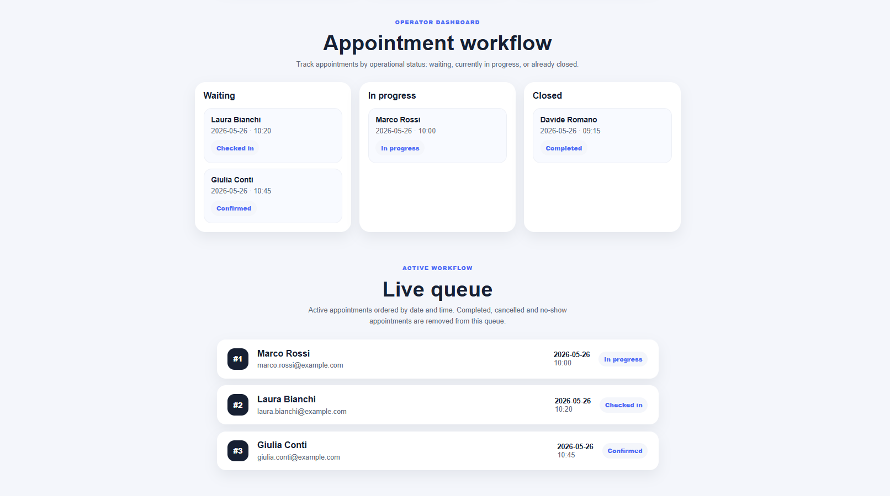
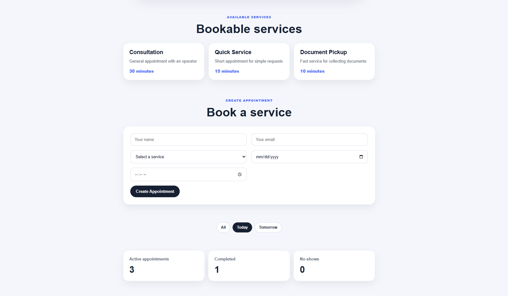
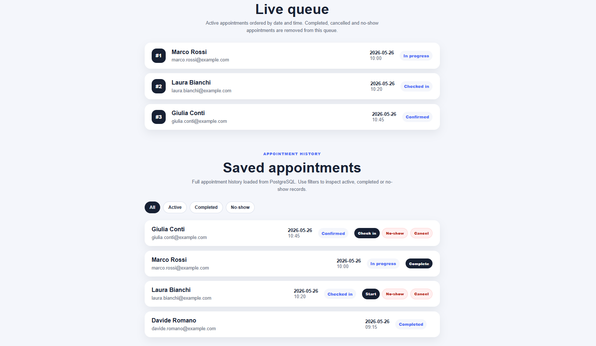

# NextUp

NextUp is a smart queue and appointment management web app for small businesses.

The project allows users to view available services, create appointments, manage appointment statuses, and monitor a live queue from a simple dashboard.

## Preview

### Operator dashboard



### Booking flow



### Appointment history and filters



## Features

- View bookable services from a PostgreSQL database
- Create appointments from a React form
- Save appointments in PostgreSQL
- View saved appointments in the frontend
- Update appointment status from the dashboard
- Manage a live queue with active appointments
- Filter appointments by status
- Show dashboard statistics for active, completed, and no-show appointments
- Backend validation for appointment requests
- Error handling for invalid services and invalid form data

## Tech Stack

### Frontend

- React
- Vite
- JavaScript
- HTML
- CSS

### Backend

- Java
- Spring Boot
- Spring Web
- Spring Data JPA
- Bean Validation

### Database

- PostgreSQL

### Tools

- Git
- GitHub
- Maven
- npm
- VS Code

## API Endpoints

### Health check

```http
GET /api/health
```

Checks if the backend is running.

### Services

```http
GET /api/services
```

Returns the list of bookable services.

### Appointments

```http
POST /api/appointments
```

Creates a new appointment.

Example request:

```json
{
  "customerName": "Mario Rossi",
  "customerEmail": "mario@example.com",
  "serviceId": 1,
  "appointmentDate": "2026-06-01",
  "appointmentTime": "10:30"
}
```

```http
GET /api/appointments
```

Returns all saved appointments.

```http
PATCH /api/appointments/{id}/status
```

Updates the status of an appointment.

Example request:

```json
{
  "status": "CHECKED_IN"
}
```

## Appointment Statuses

The app supports the following appointment statuses:

- `CONFIRMED`
- `CHECKED_IN`
- `IN_PROGRESS`
- `COMPLETED`
- `NO_SHOW`
- `CANCELLED`

## Project Structure

```text
NextUp/
├── backend/
│   └── src/main/java/com/nextup/backend/
│       ├── config/
│       ├── controller/
│       ├── model/
│       ├── repository/
│       └── service/
├── frontend/
│   └── src/
│       ├── App.jsx
│       ├── App.css
│       └── index.css
└── README.md
```

## How to Run the Project Locally

### Requirements

Make sure you have installed:

- Java 21
- Node.js and npm
- PostgreSQL
- Git

### Database setup

Create a PostgreSQL database called:

```text
nextup_db
```

The backend expects these local database settings:

```properties
spring.datasource.url=jdbc:postgresql://localhost:5432/nextup_db
spring.datasource.username=postgres
spring.datasource.password=postgres
```

### Environment variables

The backend can also read database settings from environment variables:

```properties
DB_URL=jdbc:postgresql://localhost:5432/nextup_db
DB_USERNAME=postgres
DB_PASSWORD=postgres
```

`application.properties` uses fallback values for local development, but environment variables are recommended for production or shared environments.

Example configuration files are available at:

```text
backend/src/main/resources/application.properties.example
backend/.env.example
```

These files show the configuration values and environment variable names used by the backend without exposing real secrets.

If your PostgreSQL password is different, update it locally through `DB_PASSWORD` or adjust your local `application.properties` fallback.

### Run the backend

From the project root:

```powershell
cd backend
.\mvnw.cmd spring-boot:run
```

The backend runs on:

```text
http://localhost:8080
```

### Run the frontend

From the project root, in a second terminal:

```powershell
cd frontend
npm.cmd run dev
```

The frontend runs on:

```text
http://localhost:5173
```

## What This Project Demonstrates

This project demonstrates the ability to build a full-stack web application with a real frontend, backend, and database flow.

### Frontend skills

- React state management with `useState`
- Data loading with `useEffect`
- API communication with `fetch`
- Conditional rendering based on appointment status
- Filtering appointments by status and date
- Reusable React components
- Responsive UI with CSS Grid and media queries
- User feedback for success and error states

### Backend skills

- REST API design with Spring Boot
- Layered architecture using controllers, services, repositories, and models
- PostgreSQL integration with Spring Data JPA
- Entity mapping with JPA annotations
- Repository queries with Spring Data method names
- Backend validation with Bean Validation
- Error handling with proper HTTP status codes
- Business logic for appointment workflows

### Database skills

- PostgreSQL database connection
- Automatic table generation with Hibernate
- Persistent appointment and service data
- Initial data seeding
- Duplicate booking prevention

### Product logic

- Appointment creation flow
- Live queue management
- Operator workflow board
- Appointment status transitions
- Dashboard summary metrics
- Filtering between active, completed, no-show, and cancelled records

## Current Status

This project currently includes a working full-stack appointment flow:

```text
React frontend
→ Spring Boot backend
→ Spring Data JPA repository
→ PostgreSQL database
```

Users can create appointments, update their status, filter appointment records, and monitor a live queue.

## Manual Testing Checklist

The following manual tests were used to verify the main application flow.

### Backend and frontend connection

- [ ] Start the backend on `http://localhost:8080`
- [ ] Start the frontend on `http://localhost:5173`
- [ ] Verify that the frontend shows the backend status as online
- [ ] Verify that bookable services are loaded from the backend

### Appointment creation

- [ ] Create a valid appointment from the form
- [ ] Verify that the appointment appears in Saved appointments
- [ ] Verify that the appointment appears in the Live queue
- [ ] Verify that the appointment appears in the Operator board under Waiting

### Appointment status workflow

- [ ] Move an appointment from `CONFIRMED` to `CHECKED_IN`
- [ ] Move an appointment from `CHECKED_IN` to `IN_PROGRESS`
- [ ] Move an appointment from `IN_PROGRESS` to `COMPLETED`
- [ ] Verify that completed appointments disappear from the Live queue
- [ ] Verify that completed appointments remain in Saved appointments
- [ ] Mark an appointment as `NO_SHOW`
- [ ] Cancel an appointment with `CANCELLED`

### Filters and dashboard

- [ ] Filter appointments by All
- [ ] Filter appointments by Active
- [ ] Filter appointments by Completed
- [ ] Filter appointments by No-show
- [ ] Filter appointments by Today
- [ ] Filter appointments by Tomorrow
- [ ] Verify that dashboard summary numbers update correctly

### Validation and error handling

- [ ] Try to create an appointment with an invalid email
- [ ] Verify that the backend returns `400 Bad Request`
- [ ] Try to create an appointment with a non-existing service id
- [ ] Verify that the backend returns `404 Not Found`
- [ ] Try to create two appointments with the same service, date, and time
- [ ] Verify that the backend returns `409 Conflict`
- [ ] Verify that the frontend shows a clear error message for duplicate bookings

## Known Limitations

This project is currently an MVP and still has some intentional limitations:

- There is no authentication or user role system yet
- The app does not yet support different businesses or staff accounts
- Appointments are not updated in real time across multiple browser sessions
- There are no automated tests yet
- The frontend and backend are not deployed online yet
- Appointment dates and times are handled as strings
- Appointments currently store `serviceId` instead of using a full JPA relationship with `BookableService`
- Error responses are handled, but there is no global backend error response format yet
- The UI is functional but can still be improved for mobile and production usage

## Future Improvements

- Add authentication and user roles
- Add real business opening hours
- Prevent double booking for the same time slot
- Add appointment cancellation
- Add better backend error responses
- Add automated tests
- Improve responsive UI
- Deploy frontend and backend online